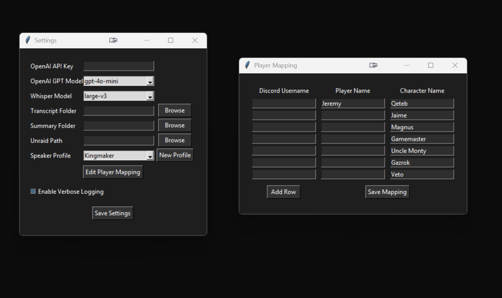
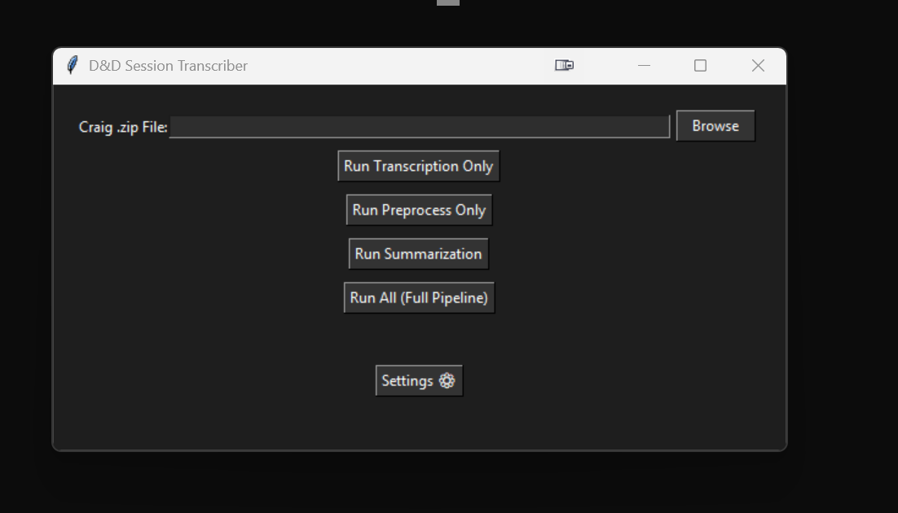
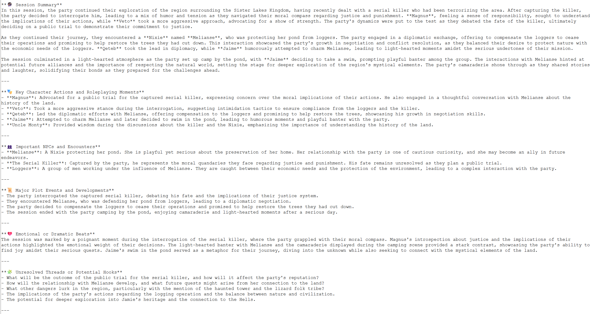
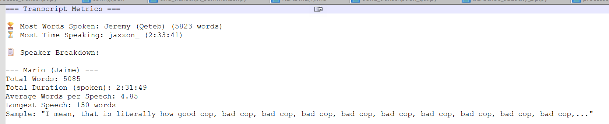

# 🧙‍♂️ The Dungeon Scribe
**A D&D Session Transcriber and Summarizer**  
Turn Craig bot multitrack audio recordings into clean transcripts, detailed summaries, and player statistics — all with the click of a button.

---

## ✨ Features

- 🎙️ **Craig Bot Audio Support**: Drop a `.zip` file from Craig and transcribe each speaker with Whisper.
- 🗣️ **Speaker Mapping**: Automatically maps Discord usernames to player and character names using customizable profiles.
- 🧼 **Transcript Cleaning**: Removes filler words and formats the output into a clean, readable style.
- 🧠 **Session Summarization**: Generates vivid summaries with GPT based on transcript content using a structured, DM-focused format.
- 📊 **Metrics Dashboard**: Calculates speaker talk time, word counts, average speech length, and identifies the longest speeches.
- 🖥️ **Modern GUI**: A dark-themed, responsive interface for managing every step of the process.
- 🧰 **Configurable Settings**: Easily adjust API keys, folder paths, models, and speaker profiles through a visual settings panel.
- 💾 **Local & NAS Storage**: Outputs are saved to local folders and mirrored to your Unraid server at `\\server\user\DND\Sessions`.

---

## 🛠 How It Works

1. **Launch the App** (`0dnd_transcription_gui.py`)
2. **Drop a Craig `.zip` file** from your D&D session.
3. **Click “Run All”** or choose:
   - Transcription Only
   - Preprocess Only
   - Summarization Only
4. **Get Your Output**
   - Transcript: `E:/SessionTranscripts/Transcripts/YYYY-MM-DD - transcript.txt`
   - Summary: `E:/SessionTranscripts/Summaries/YYYY-MM-DD - summary.txt`
   - Metrics Report: `metrics/YYYY-MM-DD - metrics.txt`

---

## 📁 Folder Structure

```
TheDungeonScribe/
├── config.json                  # Main configuration and speaker profiles
├── 0dnd_transcription_gui.py   # The GUI interface
├── transcribe_audacity_zip.py  # Audio → Transcript (Whisper)
├── preprocess_transcript.py    # Cleanup script for transcripts
├── dnd_whole_transcript_summary.py # GPT-powered summary generator
├── metrics.py                  # Speaker breakdown and metrics report
├── metrics/                    # Output folder for metrics
├── transcripts/                # (Configured) Raw transcript storage
├── summaries/                  # (Configured) Summary storage
```

---

## 🧪 Dependencies

- Python 3.10+
- `whisper`, `torch`, `pydub`, `openai`, `tiktoken`, `tkinter`

To install:
```bash
pip install openai torch pydub tiktoken git+https://github.com/openai/whisper.git
```

---

## 🧾 Example Config (`config.json`)
```json
{
  "local_transcript_dir": "E:/SessionTranscripts/Transcripts",
  "local_summary_dir": "E:/SessionTranscripts/Summaries",
  "unraid_path": "//TOWER/jwitchel/DND/Sessions",
  "openai_api_key": "your-api-key",
  "openai_model": "gpt-4o-mini",
  "whisper_model": "large-v3",
  "selected_profile": "Kingmaker",
  "speaker_profiles": {
    "Kingmaker": {
      "daddyiroh": { "player": "Jeremy", "character": "Qeteb" }
    }
  }
}
```

---

---

## 🖼️ Screenshots

> Add images here to help users understand what the app looks like and how it works.

| Feature               | Screenshot                                 |
|-----------------------|---------------------------------------------|
| 🔧 Settings Panel      |  |
| 📁 Drop Craig Zip      |  |
| 🧠 Summary Output      |   |
| 📊 Metrics Report      |   |


## 🧾 Changelog

### v1.2.0 (2025-04)
- 🔁 Speaker mapping now supports multiple profiles
- 📜 Added preprocessing script to remove filler words and clean transcript
- 📊 Added `metrics.py` for speaker statistics and participation breakdown
- 💡 Whisper model and GPT model now selected via dropdowns in settings
- 🎛 Settings panel improved with profile editor and folder pickers
- 🧪 Better error handling and logging across the pipeline
- 🖼 GUI improved with buttons for each step (transcribe, preprocess, summarize)
